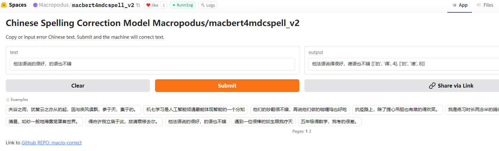

<p align="center">
    
</p>

# [macro-correct](https://github.com/yongzhuo/macro-correct) 
[](https://pypi.org/project/macro-correct/)
[](https://travis-ci.com/yongzhuo/macro-correct)
[](https://pypi.org/project/macro-correct/)
[](https://github.com/yongzhuo/macro-correct/stargazers)
[](https://github.com/yongzhuo/macro-correct/network/members)
[](https://gitter.im/yongzhuo/macro-correct?utm_source=badge&utm_medium=badge&utm_campaign=pr-badge&utm_content=badge)
>>> macro-correct, 文本纠错工具包(Text Correct), 支持中文拼写纠错/标点符号纠错(CSC, Chinese Spelling Correct / Check), CSC支持各领域数据(包括古文), 模型在大规模、各领域的、现代/当代语料上训练而得, 泛化性强.

>>> macro-correct是一个只依赖pytorch、transformers、numpy、opencc的文本纠错(CSC, 中文拼写纠错; Punct, 中文标点纠错)工具包，专注于中文文本纠错的极简自然语言处理工具包。
使用大部分市面上的开源数据集构建生成的混淆集,使用人民日报语料&学习强国语料等生成1000万+训练数据集来训练模型;
支持MDCSpell、Macbert、ReLM、SoftBERT、BertCRF等多种经典模型;
支持中文拼写纠错、中文标点符号纠错、中文语法纠错(待续)、独立的检测模型/识别模型(待续);
具有依赖轻量、代码简洁、注释详细、调试清晰、配置灵活、拓展方便、适配NLP等特性。


## 目录
* [安装](#安装)
* [调用](#调用)
* [体验](#体验)
* [词典](#词典)
* [详情](#详情)
* [训练](#训练)
* [测评](#测评)
* [日志](#日志)
* [参考](#参考)
* [论文](#论文)
* [Cite](#Cite)


# 安装 
```bash
pip install macro-correct

# 清华镜像源
pip install -i https://pypi.tuna.tsinghua.edu.cn/simple macro-correct

# 如果不行, 则不带依赖安装, 之后缺什么包再补充什么
pip install -i https://pypi.tuna.tsinghua.edu.cn/simple macro-correct --no-dependencies
```


# 调用
  更多样例sample详情见/tet目录
  - 使用example详见/tet/tet目录, 中文拼写纠错代码为tet_csc_token_zh.py, 中文标点符号纠错代码为tet_csc_punct_zh.py, CSC也可以直接用tet_csc_flag_transformers.py
  - 训练代码详见/tet/train目录, 可配置本地预训练模型地址和各种参数等;

# 体验
 - [MOdelScope---Space---Macropodus/macbert4mdcspell_v3](https://www.modelscope.cn/studios/Macadam/macbert4mdcspell_v3)
 - [MOdelScope---Space---Macropodus/macbert4mdcspell_v2](https://www.modelscope.cn/studios/Macadam/macbert4mdcspell_v2)
 - [HF---Space---Macropodus/macbert4mdcspell_v2](https://huggingface.co/spaces/Macropodus/macbert4mdcspell_v2)
 - [HF---Space---Macropodus/macbert4csc_v2](https://huggingface.co/spaces/Macropodus/macbert4csc_v2)




## 2.调用-文本纠错
### 2.1 CSC 使用 macro-bert
```python
# !/usr/bin/python
# -*- coding: utf-8 -*-
# @time    : 2021/2/29 21:41
# @author  : Mo
# @function: 文本纠错, 使用macro-correct


import os
os.environ["MACRO_CORRECT_FLAG_CSC_TOKEN"] = "1"
from macro_correct import correct
### 默认纠错(list输入)
text_list = ["真麻烦你了。希望你们好好的跳无",
             "少先队员因该为老人让坐",
             "机七学习是人工智能领遇最能体现智能的一个分知",
             "一只小鱼船浮在平净的河面上"
             ]
text_csc = correct(text_list)
print("默认纠错(list输入):")
for res_i in text_csc:
    print(res_i)
print("#" * 128)

"""
默认纠错(list输入):
{'index': 0, 'source': '真麻烦你了。希望你们好好的跳无', 'target': '真麻烦你了。希望你们好好地跳舞', 'errors': [['的', '地', 12, 0.6584], ['无', '舞', 14, 1.0]]}
{'index': 1, 'source': '少先队员因该为老人让坐', 'target': '少先队员应该为老人让坐', 'errors': [['因', '应', 4, 0.995]]}
{'index': 2, 'source': '机七学习是人工智能领遇最能体现智能的一个分知', 'target': '机器学习是人工智能领域最能体现智能的一个分支', 'errors': [['七', '器', 1, 0.9998], ['遇', '域', 10, 0.9999], ['知', '支', 21, 1.0]]}
{'index': 3, 'source': '一只小鱼船浮在平净的河面上', 'target': '一只小鱼船浮在平静的河面上', 'errors': [['净', '静', 8, 0.9961]]}
"""
```

### 2.2 CSC 使用 transformers
```bash
# !/usr/bin/python
# -*- coding: utf-8 -*-
# @time    : 2021/2/29 21:41
# @author  : Mo
# @function: transformers直接加载bert类模型测试


import traceback
import operator
import time
import sys
import os
os.environ["USE_TORCH"] = "1"
from transformers import BertConfig, BertTokenizer, BertForMaskedLM
import torch


# pretrained_model_name_or_path = "../../macro_correct/output/text_correction/macbert4mdcspell_v1"
# pretrained_model_name_or_path = "../../macro_correct/output/text_correction/macbert4csc_v1"
# pretrained_model_name_or_path = "../../macro_correct/output/text_correction/macbert4csc_v2"
# pretrained_model_name_or_path = "../../macro_correct/output/text_correction/bert4csc_v1"
# pretrained_model_name_or_path = "shibing624/macbert4csc-base-chinese"
# pretrained_model_name_or_path = "Macropodus/macbert4mdcspell_v1"
# pretrained_model_name_or_path = "Macropodus/macbert4mdcspell_v2"
pretrained_model_name_or_path = "Macropodus/macbert4mdcspell_v3"
# pretrained_model_name_or_path = "Macropodus/macbert4csc_v1"
# pretrained_model_name_or_path = "Macropodus/macbert4csc_v2"
# pretrained_model_name_or_path = "Macropodus/bert4csc_v1"
device = torch.device("cuda" if torch.cuda.is_available() else "cpu")
max_len = 128

print("load model, please wait a few minute!")
tokenizer = BertTokenizer.from_pretrained(pretrained_model_name_or_path)
bert_config = BertConfig.from_pretrained(pretrained_model_name_or_path)
model = BertForMaskedLM.from_pretrained(pretrained_model_name_or_path)
model.to(device)
vocab = tokenizer.vocab
print("load model success!")

texts = [
    "机七学习是人工智能领遇最能体现智能的一个分知",
    "我是练习时长两念半的鸽仁练习生蔡徐坤",
    "真麻烦你了。希望你们好好的跳无",
    "他法语说的很好，的语也不错",
    "遇到一位很棒的奴生跟我疗天",
    "我们为这个目标努力不解",
]
len_mid = min(max_len, max([len(t)+2 for t in texts]))

with torch.no_grad():
    outputs = model(**tokenizer(texts, padding=True, max_length=len_mid,
                                return_tensors="pt").to(device))


def flag_total_chinese(text):
    """
    judge is total chinese or not, 判断是不是全是中文
    Args:
        text: str, eg. "macadam, 碎石路"
    Returns:
        bool, True or False
    """
    for word in text:
        if not "\u4e00" <= word <= "\u9fa5":
            return False
    return True

def get_errors_from_diff_length(corrected_text, origin_text, unk_tokens=[], know_tokens=[]):
    """Get errors between corrected text and origin text
    code from:  https://github.com/shibing624/pycorrector
    """
    new_corrected_text = ""
    errors = []
    i, j = 0, 0
    unk_tokens = unk_tokens or [' ', '“', '”', '‘', '’', '琊', '\n', '…', '擤', '\t', '玕', '']
    while i < len(origin_text) and j < len(corrected_text):
        if origin_text[i] in unk_tokens or origin_text[i] not in know_tokens:
            new_corrected_text += origin_text[i]
            i += 1
        elif corrected_text[j] in unk_tokens:
            new_corrected_text += corrected_text[j]
            j += 1
        # Deal with Chinese characters
        elif flag_total_chinese(origin_text[i]) and flag_total_chinese(corrected_text[j]):
            # If the two characters are the same, then the two pointers move forward together
            if origin_text[i] == corrected_text[j]:
                new_corrected_text += corrected_text[j]
                i += 1
                j += 1
            else:
                # Check for insertion errors
                if j + 1 < len(corrected_text) and origin_text[i] == corrected_text[j + 1]:
                    errors.append(('', corrected_text[j], j))
                    new_corrected_text += corrected_text[j]
                    j += 1
                # Check for deletion errors
                elif i + 1 < len(origin_text) and origin_text[i + 1] == corrected_text[j]:
                    errors.append((origin_text[i], '', i))
                    i += 1
                # Check for replacement errors
                else:
                    errors.append((origin_text[i], corrected_text[j], i))
                    new_corrected_text += corrected_text[j]
                    i += 1
                    j += 1
        else:
            new_corrected_text += origin_text[i]
            if origin_text[i] == corrected_text[j]:
                j += 1
            i += 1
    errors = sorted(errors, key=operator.itemgetter(2))
    return new_corrected_text, errors

def get_errors_from_same_length(corrected_text, origin_text, unk_tokens=[], know_tokens=[]):
        """Get new corrected text and errors between corrected text and origin text
        code from:  https://github.com/shibing624/pycorrector
        """
        errors = []
        unk_tokens = unk_tokens or [' ', '“', '”', '‘', '’', '琊', '\n', '…', '擤', '\t', '玕', '', '，']

        for i, ori_char in enumerate(origin_text):
            if i >= len(corrected_text):
                continue
            if ori_char in unk_tokens or ori_char not in know_tokens:
                # deal with unk word
                corrected_text = corrected_text[:i] + ori_char + corrected_text[i + 1:]
                continue
            if ori_char != corrected_text[i]:
                if not flag_total_chinese(ori_char):
                    # pass not chinese char
                    corrected_text = corrected_text[:i] + ori_char + corrected_text[i + 1:]
                    continue
                if not flag_total_chinese(corrected_text[i]):
                    corrected_text = corrected_text[:i] + corrected_text[i + 1:]
                    continue
                errors.append([ori_char, corrected_text[i], i])
        errors = sorted(errors, key=operator.itemgetter(2))
        return corrected_text, errors

def get_errors(text, probs):
    """   获取错误信息   """
    _text = tokenizer.decode(torch.argmax(probs, dim=-1), skip_special_tokens=True).replace(' ', '')
    corrected_text = _text[:len(text)]
    if len(corrected_text) == len(text):
        corrected_text, details = get_errors_from_same_length(corrected_text, text, know_tokens=vocab)
    else:
        corrected_text, details = get_errors_from_diff_length(corrected_text, text, know_tokens=vocab)
    print(text, ' => ', corrected_text, details)
    return details


for probs, source in zip(outputs.logits, texts):
    errors = get_errors(source, probs)

"""
机七学习是人工智能领遇最能体现智能的一个分知  =>  机器学习是人工智能领域最能体现智能的一个分支 [['七', '器', 1], ['遇', '域', 10], ['知', '支', 21]]
我是练习时长两念半的鸽仁练习生蔡徐坤  =>  我是练习时长两年半的个人练习生蔡徐坤 [['念', '年', 7], ['鸽', '个', 10], ['仁', '人', 11]]
真麻烦你了。希望你们好好的跳无  =>  真麻烦你了。希望你们好好地跳舞 [['的', '地', 12], ['无', '舞', 14]]
他法语说的很好，的语也不错  =>  他法语说得很好，德语也不错 [['的', '得', 4], ['的', '德', 8]]
遇到一位很棒的奴生跟我疗天  =>  遇到一位很棒的女生跟我聊天 [['奴', '女', 7], ['疗', '聊', 11]]
我们为这个目标努力不解  =>  我们为这个目标努力不懈 [['解', '懈', 10]]
"""
```

## 3.调用-标点纠错
```python
import os
os.environ["MACRO_CORRECT_FLAG_CSC_PUNCT"] = "1"
from macro_correct import correct_punct


### 1.默认标点纠错(list输入)
text_list = ["山不在高有仙则名。",
             "水不在深，有龙则灵",
             "斯是陋室惟吾德馨",
             "苔痕上阶绿草,色入帘青。"
             ]
text_csc = correct_punct(text_list)
print("默认标点纠错(list输入):")
for res_i in text_csc:
    print(res_i)
print("#" * 128)

"""
默认标点纠错(list输入):
{'index': 0, 'source': '山不在高有仙则名。', 'target': '山不在高，有仙则名。', 'score': 0.9917, 'errors': [['', '，', 4, 0.9917]]}
{'index': 1, 'source': '水不在深，有龙则灵', 'target': '水不在深，有龙则灵。', 'score': 0.9995, 'errors': [['', '。', 9, 0.9995]]}
{'index': 2, 'source': '斯是陋室惟吾德馨', 'target': '斯是陋室，惟吾德馨。', 'score': 0.9999, 'errors': [['', '，', 4, 0.9999], ['', '。', 8, 0.9998]]}
{'index': 3, 'source': '苔痕上阶绿草,色入帘青。', 'target': '苔痕上阶绿，草色入帘青。', 'score': 0.9998, 'errors': [['', '，', 5, 0.9998]]}
"""
```

# 词典
## 默认混淆词典地址
* macro_correct/output/confusion_dict.json
## 操作混淆词典
```python
## 自定义混淆词典
# !/usr/bin/python
# -*- coding: utf-8 -*-
# @time    : 2021/2/29 21:41
# @author  : Mo
# @function: tet csc of token confusion dict, 混淆词典


import os
os.environ["MACRO_CORRECT_FLAG_CSC_TOKEN"] = "1"

from macro_correct.pytorch_textcorrection.tcTrie import ConfusionCorrect
from macro_correct import MODEL_CSC_TOKEN
from macro_correct import correct


### 默认使用混淆词典
user_dict = {
    "乐而往返": "乐而忘返",
    "金钢钻": "金刚钻",
    "藤罗蔓": "藤萝蔓",
}
text_list = [
    "为什么乐而往返？",
    "没有金钢钻就不揽瓷活！",
    "你喜欢藤罗蔓吗？",
    "三周年祭日在哪举行？"
]
text_csc = correct(text_list, flag_confusion=False)
print("默认纠错(不带混淆词典):")
for res_i in text_csc:
    print(res_i)
print("#" * 128)


text_csc = correct(text_list, flag_confusion=True)
print("默认纠错(-带混淆词典-默认):")
for res_i in text_csc:
    print(res_i)
print("#" * 128)


# ---混淆词典---
### 只新增, 新增用户词典(默认混淆词典也使用)
MODEL_CSC_TOKEN.model_csc.model_confusion = ConfusionCorrect(user_dict=user_dict)
text_csc = correct(text_list, flag_confusion=True)
print("默认纠错(-带混淆词典-新增):")
for res_i in text_csc:
    print(res_i)
print("#" * 128)
### 全覆盖, 只使用用户词典(默认混淆词典废弃)
MODEL_CSC_TOKEN.model_csc.model_confusion = ConfusionCorrect(confusion_dict=user_dict)
text_csc = correct(text_list, flag_confusion=True)
print("默认纠错(-带混淆词典-全覆盖):")
for res_i in text_csc:
    print(res_i)
print("#" * 128)


# ---混淆词典文件---
### 只新增, 新增用户词典(默认混淆词典也使用), path不为空即可; json文件, {混淆词语:正确词语} key-value; 详见macro-correct/tet/tet/tet_csc_token_confusion.py
path_user = "./user_confusion_dict.json"
MODEL_CSC_TOKEN.model_csc.model_confusion = ConfusionCorrect(path="1", path_user=path_user)
text_csc = correct(text_list, flag_confusion=True)
print("默认纠错(-带混淆词典文件-新增):")
for res_i in text_csc:
    print(res_i)
print("#" * 128)
### 全覆盖, 只使用用户词典(默认混淆词典废弃); path必须传空字符串
MODEL_CSC_TOKEN.model_csc.model_confusion = ConfusionCorrect(path="", path_user=path_user)
text_csc = correct(text_list, flag_confusion=True)
print("默认纠错(-带混淆词典文件-全覆盖):")
for res_i in text_csc:
    print(res_i)
print("#" * 128)

"""
默认纠错(不带混淆词典):
{'index': 0, 'source': '为什么乐而往返？', 'target': '为什么乐而往返？', 'errors': []}
{'index': 1, 'source': '没有金钢钻就不揽瓷活！', 'target': '没有金刚钻就不揽瓷活！', 'errors': [['钢', '刚', 3, 0.6587]]}
{'index': 2, 'source': '你喜欢藤罗蔓吗？', 'target': '你喜欢藤萝蔓吗？', 'errors': [['罗', '萝', 4, 0.8582]]}
{'index': 3, 'source': '三周年祭日在哪举行？', 'target': '三周年祭日在哪举行？', 'errors': []}
################################################################################################################################
默认纠错(-带混淆词典-默认):
{'index': 0, 'source': '为什么乐而往返？', 'target': '为什么乐而往返？', 'errors': []}
{'index': 1, 'source': '没有金钢钻就不揽瓷活！', 'target': '没有金刚钻就不揽瓷活！', 'errors': [['钢', '刚', 3, 1.0]]}
{'index': 2, 'source': '你喜欢藤罗蔓吗？', 'target': '你喜欢藤萝蔓吗？', 'errors': [['罗', '萝', 4, 0.8582]]}
{'index': 3, 'source': '三周年祭日在哪举行？', 'target': '三周年忌日在哪举行？', 'errors': [['祭', '忌', 3, 1.0]]}
################################################################################################################################
默认纠错(-带混淆词典-新增):
{'index': 0, 'source': '为什么乐而往返？', 'target': '为什么乐而忘返？', 'errors': [['往', '忘', 5, 1.0]]}
{'index': 1, 'source': '没有金钢钻就不揽瓷活！', 'target': '没有金刚钻就不揽瓷活！', 'errors': [['钢', '刚', 3, 1.0]]}
{'index': 2, 'source': '你喜欢藤罗蔓吗？', 'target': '你喜欢藤萝蔓吗？', 'errors': [['罗', '萝', 4, 1.0]]}
{'index': 3, 'source': '三周年祭日在哪举行？', 'target': '三周年忌日在哪举行？', 'errors': [['祭', '忌', 3, 1.0]]}
################################################################################################################################
默认纠错(-带混淆词典-全覆盖):
{'index': 0, 'source': '为什么乐而往返？', 'target': '为什么乐而忘返？', 'errors': [['往', '忘', 5, 1.0]]}
{'index': 1, 'source': '没有金钢钻就不揽瓷活！', 'target': '没有金刚钻就不揽瓷活！', 'errors': [['钢', '刚', 3, 1.0]]}
{'index': 2, 'source': '你喜欢藤罗蔓吗？', 'target': '你喜欢藤萝蔓吗？', 'errors': [['罗', '萝', 4, 1.0]]}
{'index': 3, 'source': '三周年祭日在哪举行？', 'target': '三周年祭日在哪举行？', 'errors': []}
################################################################################################################################
默认纠错(-带混淆词典文件-新增):
{'index': 0, 'source': '为什么乐而往返？', 'target': '为什么乐而忘返？', 'errors': [['往', '忘', 5, 1.0]]}
{'index': 1, 'source': '没有金钢钻就不揽瓷活！', 'target': '没有金刚钻就不揽瓷活！', 'errors': [['钢', '刚', 3, 1.0]]}
{'index': 2, 'source': '你喜欢藤罗蔓吗？', 'target': '你喜欢藤萝蔓吗？', 'errors': [['罗', '萝', 4, 1.0]]}
{'index': 3, 'source': '三周年祭日在哪举行？', 'target': '三周年忌日在哪举行？', 'errors': [['祭', '忌', 3, 1.0]]}
################################################################################################################################
默认纠错(-带混淆词典文件-全覆盖):
{'index': 0, 'source': '为什么乐而往返？', 'target': '为什么乐而忘返？', 'errors': [['往', '忘', 5, 1.0]]}
{'index': 1, 'source': '没有金钢钻就不揽瓷活！', 'target': '没有金刚钻就不揽瓷活！', 'errors': [['钢', '刚', 3, 1.0]]}
{'index': 2, 'source': '你喜欢藤罗蔓吗？', 'target': '你喜欢藤萝蔓吗？', 'errors': [['罗', '萝', 4, 1.0]]}
{'index': 3, 'source': '三周年祭日在哪举行？', 'target': '三周年祭日在哪举行？', 'errors': []}
################################################################################################################################
"""
```


# 详情
## CSC调用(超参数说明)
```python
import os
os.environ["MACRO_CORRECT_FLAG_CSC_TOKEN"] = "1"
from macro_correct import correct
### 默认纠错(list输入)
text_list = ["真麻烦你了。希望你们好好的跳无",
             "少先队员因该为老人让坐",
             "机七学习是人工智能领遇最能体现智能的一个分知",
             "一只小鱼船浮在平净的河面上"
             ]
### 默认纠错(list输入, 参数配置)
params = {
    "threshold": 0.55,  # token阈值过滤
    "batch_size": 32,  # 批大小
    "max_len": 128,  # 自定义的长度, 如果截断了, 则截断部分不参与纠错, 后续直接一模一样的补回来
    "rounded": 4,  # 保存4位小数
    "flag_confusion": True,  # 是否使用默认的混淆词典
    "flag_prob": True,  # 是否返回纠错token处的概率
    "flag_cut": False,  # 是否切分句子, 长句, False会只处理前max_len长度的文本; True会按照标点切分(在超出就按照maxlen切分)
}
text_csc = correct(text_list, **params)
print("默认纠错(list输入, 参数配置):")
for res_i in text_csc:
    print(res_i)
print("#" * 128)


"""
默认纠错(list输入):
{'index': 0, 'source': '真麻烦你了。希望你们好好的跳无', 'target': '真麻烦你了。希望你们好好地跳舞', 'errors': [['的', '地', 12, 0.6584], ['无', '舞', 14, 1.0]]}
{'index': 1, 'source': '少先队员因该为老人让坐', 'target': '少先队员应该为老人让坐', 'errors': [['因', '应', 4, 0.995]]}
{'index': 2, 'source': '机七学习是人工智能领遇最能体现智能的一个分知', 'target': '机器学习是人工智能领域最能体现智能的一个分支', 'errors': [['七', '器', 1, 0.9998], ['遇', '域', 10, 0.9999], ['知', '支', 21, 1.0]]}
{'index': 3, 'source': '一只小鱼船浮在平净的河面上', 'target': '一只小鱼船浮在平静的河面上', 'errors': [['净', '静', 8, 0.9961]]}
"""
```
## PUNCT调用(超参数说明)
```python
import os
os.environ["MACRO_CORRECT_FLAG_CSC_PUNCT"] = "1"
from macro_correct import correct_punct


### 1.默认标点纠错(list输入)
text_list = ["山不在高有仙则名。",
             "水不在深，有龙则灵",
             "斯是陋室惟吾德馨",
             "苔痕上阶绿草,色入帘青。"
             ]
### 2.默认标点纠错(list输入, 参数配置详情)
params = {
        "limit_num_errors": 4,  # 一句话最多的错别字, 多的就剔除
        "limit_len_char": 4,   # 一句话的最小字符数
        "threshold_zh": 0.5,  # 句子阈值, 中文字符占比的最低值
        "threshold": 0.55,  # token阈值过滤
        "batch_size": 32,  # 批大小
        "max_len": 128,  # 自定义的长度, 如果截断了, 则截断部分不参与纠错, 后续直接一模一样的补回来
        "rounded": 4,  # 保存4位小数
        "flag_prob": True,  # 是否返回纠错token处的概率
    }
text_csc = correct_punct(text_list, **params)
print("默认标点纠错(list输入):")
for res_i in text_csc:
    print(res_i)
print("#" * 128)

"""
默认标点纠错(list输入):
{'index': 0, 'source': '山不在高有仙则名。', 'target': '山不在高，有仙则名。', 'score': 0.9917, 'errors': [['', '，', 4, 0.9917]]}
{'index': 1, 'source': '水不在深，有龙则灵', 'target': '水不在深，有龙则灵。', 'score': 0.9995, 'errors': [['', '。', 9, 0.9995]]}
{'index': 2, 'source': '斯是陋室惟吾德馨', 'target': '斯是陋室，惟吾德馨。', 'score': 0.9999, 'errors': [['', '，', 4, 0.9999], ['', '。', 8, 0.9998]]}
{'index': 3, 'source': '苔痕上阶绿草,色入帘青。', 'target': '苔痕上阶绿，草色入帘青。', 'score': 0.9998, 'errors': [['', '，', 5, 0.9998]]}
"""
```
## CSC调用繁体
```python
import os
os.environ["MACRO_CORRECT_FLAG_CSC_TOKEN"] = "1"

from macro_correct import correct_tradition


### 默认纠错(list输入)
text_list = ["一個分知,陌光回聚,莪受打去,禰愛帶餘",
            "余額還有100w",
            "放在陌光下",
            "真麻煩你了。希望你們好好的跳舞",
            "少先隊員因該爲老人讓坐",
            "機七學習是人工智能領遇最能體現智能的一個分知",
            "一只小魚船浮在平淨的河面上",
            "這一條次,我選擇了一條與往常不同的路線。",
            "春節發貨部"
             ]
### 默认纠错(list输入, 参数配置)
params = {
    "flag_confusion": True,  # 是否使用默认的混淆词典
    "flag_prob": True,  # 是否返回纠错token处的概率
    "flag_cut": True,  # 是否切分句子, 长句, False会只处理前max_len长度的文本; True会按照标点切分(在超出就按照maxlen切分)
    "limit_nums_errors": 8,  # 一句话最多的错别字, 多的就剔除(全不纠错)
    "num_rethink": 0,  # 多次预测, think-twice
    "batch_size": 32,  # 批大小
    "threshold": 0.01,  # token阈值过滤
    "max_len": 128,  # 自定义的长度, 如果截断了, 则截断部分不参与纠错, 后续直接一模一样的补回来
    "rounded": 4,  # 保存4位小数
}
text_csc = correct_tradition(text_list, **params)
print("默认纠错(list输入, 参数配置):")
for res_i in text_csc:
    print(res_i)
print("#" * 128)

"""
默认纠错(list输入, 参数配置):
{'index': 0, 'source': '一個分知,陌光回聚,莪受打去,禰愛帶餘', 'target': '一個分支，陽光回聚，莪受打擊，禰愛帶餘', 'errors': [['知', '支', 3, 1.0], ['陌', '陽', 5, 1.0], ['去', '擊', 13, 1.0]]}
{'index': 1, 'source': '余額還有100w', 'target': '餘額還有100w', 'errors': [['余', '餘', 0, 1]]}
{'index': 2, 'source': '放在陌光下', 'target': '放在陽光下', 'errors': [['陌', '陽', 2, 1.0]]}
{'index': 3, 'source': '真麻煩你了。希望你們好好的跳舞', 'target': '真麻煩你了。希望你們好好地跳舞', 'errors': [['的', '地', 12, 0.8873]]}
{'index': 4, 'source': '少先隊員因該爲老人讓坐', 'target': '少先隊員應該爲老人讓坐', 'errors': [['因', '應', 4, 0.9933]]}
{'index': 5, 'source': '機七學習是人工智能領遇最能體現智能的一個分知', 'target': '機器學習是人工智能領域最能體現智能的一個分支', 'errors': [['七', '器', 1, 0.9999], ['遇', '域', 10, 1.0], ['知', '支', 21, 1.0]]}
{'index': 6, 'source': '一只小魚船浮在平淨的河面上', 'target': '一隻小魚船浮在平靜的河面上', 'errors': [['只', '隻', 1, 1], ['淨', '靜', 8, 0.9849]]}
{'index': 7, 'source': '這一條次,我選擇了一條與往常不同的路線。', 'target': '這一條次，我選擇了一條與往常不同的路線。', 'errors': []}
{'index': 8, 'source': '春節發貨部', 'target': '春節發貨不', 'errors': [['部', '不', 4, 0.3544]]}
################################################################################################################################
"""
```
# 训练
## CSC任务
### 目录地址
* macbert4mdcspell: macro_correct/pytorch_user_models/csc/macbert4mdcspell/train_yield.py
* macbert4csc: macro_correct/pytorch_user_models/csc/macbert4csc/train_yield.py
* relm: macro_correct/pytorch_user_models/csc/relm/train_yield.py
### 数据准备
* espell: list<dict>的json文件结构, 带"original_text"和"correct_text"就好, 参考macro_correct/corpus/text_correction/espell
```
[
    {
        "original_text": "遇到逆竟时，我们必须勇于面对，而且要愈挫愈勇，这样我们才能朝著成功之路前进。",
        "correct_text": "遇到逆境时，我们必须勇于面对，而且要愈挫愈勇，这样我们才能朝著成功之路前进。",
    }
]
```
* sighan: list<dict>的json文件结构, 带"source"和"target"就好, 参考macro_correct/corpus/text_correction/sighan
```
[
    {
        "source": "若被告人正在劳动教养，则可以通过劳动教养单位转交",
        "target": "若被告人正在劳动教养，则可以通过劳动教养单位转交",
    }
]
```
### 配置-训练-验证-预测
#### 配置
配置好数据地址和超参, 参考macro_correct/pytorch_user_models/csc/macbert4mdcspell/config.py
#### 训练-验证-预测
```
训练
nohup python train_yield.py > tc.train_yield.py.log 2>&1 &
tail -n 1000  -f tc.train_yield.py.log
验证
python eval_std.py
预测
python predict.py
```

## PUNCT任务
### 目录地址
* PUNCT: macro_correct/pytorch_sequencelabeling/slRun.py
### 数据准备
* SPAN格式: NER任务, 默认用span格式(jsonl), 参考macro_correct/corpus/sequence_labeling/chinese_symbol的chinese_symbol.dev.span文件
```
{'label': [{'type': '0', 'ent': '下', 'pos': [7, 7]}, {'type': '1', 'ent': '林', 'pos': [14, 14]}], 'text': '#桂林山水甲天下阳朔山水甲桂林'}
{'label': [{'type': '11', 'ent': 'o', 'pos': [5, 5]}, {'type': '0', 'ent': 't', 'pos': [12, 12]}, {'type': '1', 'ent': '包', 'pos': [19, 19]}], 'text': '#macrocorrect文本纠错工具包'}
```
* CONLL格式: 生成SPAN格式后, 用macro_correct/tet/corpus/pos_to_conll.py转换一下就好
```
神 O
秘 O
宝 O
藏 B-1
在 O
旅 O
途 O
中 B-0
他 O
```
### 配置-训练-验证-预测
#### 配置
配置好数据地址和超参, 参考macro_correct/pytorch_user_models/csc/macbert4mdcspell/config.py
#### 训练-验证-预测
```
训练
nohup python train_yield.py > tc.train_yield.py.log 2>&1 &
tail -n 1000  -f tc.train_yield.py.log
验证
python eval_std.py
预测
python predict.py
```


# 测评
## 说明
* 所有训练数据均来自公网或开源数据, 训练数据为1千万左右, 混淆词典较大;
* 所有测试数据均来自公网或开源数据, 测评数据地址为[Macropodus/csc_eval_public](https://huggingface.co/datasets/Macropodus/csc_eval_public);
* 测评代码主要为[tcEval.py](https://github.com/yongzhuo/macro-correct/macro_correct/pytorch_textcorrection/tcEval.py); 其中[qwen25_1-5b_pycorrector]()的测评代码在目录[eval](https://github.com/yongzhuo/macro-correct/tet/eval)
* 评估标准：过纠率(过度纠错, 即高质量正确句子的错误纠正); 句子级宽松标准的准确率/精确率/召回率/F1(同[shibing624/pycorrector](https://github.com/shibing624/pycorrector)); 句子级严格标准的准确率/精确率/召回率/F1(同[wangwang110/CSC](https://github.com/wangwang110/CSC)); 字符级别的准确率/精确率/召回率/F1(错别字);
* qwen25_1-5b_pycorrector权重地址在[shibing624/chinese-text-correction-1.5b](https://huggingface.co/shibing624/chinese-text-correction-1.5b)
* macbert4csc_pycorrector权重地址在[shibing624/macbert4csc-base-chinese](https://huggingface.co/shibing624/macbert4csc-base-chinese);
* macbert4mdcspell_v1权重地址在[Macropodus/macbert4mdcspell_v1](https://huggingface.co/Macropodus/macbert4mdcspell_v1);
* macbert4mdcspell_v2权重地址在[Macropodus/macbert4mdcspell_v2](https://huggingface.co/Macropodus/macbert4mdcspell_v2);
* macbert4mdcspell_v3权重地址在[Macropodus/macbert4mdcspell_v3](https://huggingface.co/Macropodus/macbert4mdcspell_v3);
* macbert4csc_v2权重地址在[Macropodus/macbert4csc_v2](https://huggingface.co/Macropodus/macbert4csc_v2);
* macbert4csc_v1权重地址在[Macropodus/macbert4csc_v1](https://huggingface.co/Macropodus/macbert4csc_v1);
* bert4csc_v1权重地址在[Macropodus/bert4csc_v1](https://huggingface.co/Macropodus/bert4csc_v1);

## 3.1 测评数据
``` 
1.gen_de3.json(5545): '的地得'纠错, 由人民日报/学习强国/chinese-poetry等高质量数据人工生成;
2.lemon_v2.tet.json(1053): relm论文提出的数据, 多领域拼写纠错数据集(7个领域), ; 包括game(GAM), encyclopedia (ENC), contract (COT), medical care(MEC), car (CAR), novel (NOV), and news (NEW)等领域;
3.acc_rmrb.tet.json(4636): 来自NER-199801(人民日报高质量语料);
4.acc_xxqg.tet.json(5000): 来自学习强国网站的高质量语料;
5.gen_passage.tet.json(10000): 源数据为qwen生成的好词好句, 由几乎所有的开源数据汇总的混淆词典生成;
6.textproof.tet.json(1447): NLP竞赛数据, TextProofreadingCompetition;
7.gen_xxqg.tet.json(5000): 源数据为学习强国网站的高质量语料, 由几乎所有的开源数据汇总的混淆词典生成;
8.faspell.dev.json(1000): 视频字幕通过OCR后获取的数据集; 来自爱奇艺的论文faspell;
9.lomo_tet.json(5000): 主要为音似中文拼写纠错数据集; 来自腾讯; 人工标注的数据集CSCD-NS;
10.mcsc_tet.5000.json(5000): 医学拼写纠错; 来自腾讯医典APP的真实历史日志; 注意论文说该数据集只关注医学实体的纠错, 常用字等的纠错并不关注;
11.ecspell.dev.json(1500): 来自ECSpell论文, 包括(law/med/gov)等三个领域;
12.sighan2013.dev.json(1000): 来自sighan13会议;
13.sighan2014.dev.json(1062): 来自sighan14会议;
14.sighan2015.dev.json(1100): 来自sighan15会议;
15.wenyanwen_and_poetry.tet.json(5000), 来自课本古诗和通用文言文;
```

## 3.2 测评再说明
```
1.数据预处理, 测评数据都经过 全角转半角,繁简转化,标点符号标准化等操作;
2.指标带common的极为宽松指标, 同开源项目pycorrector的评估指标;
3.指标带strict的极为严格指标, 同开源项目[wangwang110/CSC](https://github.com/wangwang110/CSC);
4.macbert4mdcspell_v1/v2模型为训练使用mdcspell架构+bert的mlm-loss, 但是推理的时候只用bert-mlm;
5.acc_rmrb/acc_xxqg数据集没有错误, 用于评估模型的误纠率(过度纠错);
6.qwen25_1-5b_pycorrector的模型为shibing624/chinese-text-correction-1.5b, 其训练数据包括了lemon_v2/mcsc_tet/ecspell的验证集和测试集, 其他的bert类模型的训练不包括验证集和测试集;
7.xxx_rethink1是指再多预测1次, xxx_thr30表示阈值为0.3;
```

## 3.3 测评结果
### 3.3.1 F1(common_cor_f1)
| model/common_cor_f1                     | avg| gen_de3| lemon_v2| gen_passage| text_proof| gen_xxqg| faspell| lomo_tet| mcsc_tet| ecspell| sighan2013| sighan2014| sighan2015 |
|:----------------------------------------|:-----------------|:-----------------|:-----------------|:-----------------|:-----------------|:-----------------|:-----------------|:-----------------|:-----------------|:-----------------|:-----------------|:-----------------|:-----------------|
| shibing624/macbert4csc-base-chinese     | 45.8| 42.44| 42.89| 31.49| 46.31| 26.06| 32.7| 44.83| 27.93| 55.51| 70.89| 61.72| 66.81 |
| shibing624/chinese-text-correction-1.5b | 45.11| 27.29| 89.48| 14.61| 83.9| 13.84| 18.2| 36.71| 96.29| 88.2| 36.41| 15.64| 20.73 |
| twnlp/ChineseErrorCorrector3-4B         | 53.59| 30.28| 89.43| 22.94| 39.9| 16.89| 30.53| 71.0| 99.92| 72.43| 65.02| 47.81| 56.88 |
| relm_v1                                 | 54.12| 89.86| 51.79| 38.4| 63.74| 30.6| 31.95| 49.82| 64.7| 73.57| 66.4| 39.87| 48.8 |
| bert4csc_v1                             | 62.28| 93.73| 61.99| 44.79| 68.0| 35.03| 48.28| 61.8| 64.41| 79.11| 77.66| 51.01| 61.54 |
| macbert4csc_v1                          | 68.55| 96.67| 65.63| 48.4| 75.65| 38.43| 51.76| 70.11| 80.63| 85.55| 81.38| 57.63| 70.7 |
| macbert4csc_v2                          | 68.6| 96.74| 66.02| 48.26| 75.78| 38.84| 51.91| 70.17| 80.71| 85.61| 80.97| 58.22| 69.95 |
| macbert4mdcspell_v1                     | 71.1| 96.42| 70.06| 52.55| 79.61| 43.37| 53.85| 70.9| 82.38| 87.46| 84.2| 61.08| 71.32 |
| macbert4mdcspell_v2                     | 71.23| 96.42| 65.8| 52.35| 75.94| 43.5| 53.82| 72.66| 82.28| 88.69| 82.51| 65.59| 75.26 |
| macbert4mdcspell_v3                     | 71.71| 96.43| 68.07| 59.36| 78.81| 50.07| 48.67| 74.51| 79.03| 87.16| 81.31| 64.29| 72.76 |
| macbert4mdcspell_v1_rethink2            | 69.64| 92.4| 67.99| 57.69| 77.49| 50.38| 53.96| 69.35| 84.65| 88.26| 70.96| 56.05| 66.54 |
| macbert4mdcspell_v2_rethink2            | 72.54| 95.59| 65.54| 58.01| 75.86| 49.67| 55.56| 72.78| 84.65| 90.78| 80.93| 65.74| 75.39 |
| macbert4mdcspell_v3_rethink2            | 71.82| 95.05| 67.48| 62.19| 78.0| 55.2| 49.5| 74.26| 81.72| 87.56| 76.75| 62.96| 71.12 |

### 3.3.2 acc(common_cor_acc)
| model/common_cor_acc                    | avg   | gen_de3| lemon_v2| gen_passage| text_proof| gen_xxqg| faspell| lomo_tet| mcsc_tet| ecspell| sighan2013| sighan2014| sighan2015 |
|:----------------------------------------|:------|:-----------------|:-----------------|:-----------------|:-----------------|:-----------------|:-----------------|:-----------------|:-----------------|:-----------------|:-----------------|:-----------------|:-----------------|
| shibing624/macbert4csc-base-chinese     | 48.26 | 26.96| 28.68| 34.16| 55.29| 28.38| 22.2| 60.96| 57.16| 67.73| 55.9| 68.93| 72.73 |
| shibing624/chinese-text-correction-1.5b | 46.09 | 15.82| 81.29| 22.96| 82.17| 19.04| 12.8| 50.2| 96.4| 89.13| 22.8| 27.87| 32.55 |
| twnlp/ChineseErrorCorrector3-4B         | 51.85 | 17.87| 81.2| 27.32| 48.17| 23.44| 20.8| 77.16| 99.92| 76.6| 49.0| 47.18| 53.55 |
| relm_v1                                 | 51.9  | 81.71| 36.18| 37.04| 63.99| 29.34| 22.9| 51.98| 74.1| 76.0| 50.3| 45.76| 53.45 |
| bert4csc_v1                             | 60.76 | 88.21| 45.96| 43.13| 68.97| 35.0| 34.0| 65.86| 73.26| 81.8| 64.5| 61.11| 67.27 |
| macbert4csc_v1                          | 65.34 | 93.56| 49.76| 44.98| 74.64| 36.1| 37.0| 73.0| 83.6| 86.87| 69.2| 62.62| 72.73 |
| macbert4csc_v2                          | 65.22 | 93.69| 50.14| 44.92| 74.64| 36.26| 37.0| 72.72| 83.66| 86.93| 68.5| 62.43| 71.73 |
| macbert4mdcspell_v1                     | 67.15 | 93.09| 54.8| 47.71| 78.09| 39.52| 38.8| 71.92| 84.78| 88.27| 73.2| 63.28| 72.36 |
| macbert4mdcspell_v2                     | 68.31 | 93.09| 50.05| 48.72| 75.74| 40.52| 38.9| 76.9| 84.8| 89.73| 71.0| 71.94| 78.36 |
| macbert4mdcspell_v3                     | 68.09 | 93.11| 52.42| 53.91| 77.89| 45.28| 34.2| 76.82| 82.5| 88.13| 69.2| 68.83| 74.82 |
| macbert4mdcspell_v1_rethink2            | 65.04 | 85.88| 52.42| 51.69| 76.23| 44.52| 38.9| 70.78| 86.48| 88.93| 55.8| 59.98| 68.91 |
| macbert4mdcspell_v2_rethink2            | 69.14 | 91.56| 49.76| 53.01| 75.67| 44.84| 40.5| 76.98| 86.56| 91.47| 68.8| 72.03| 78.45 |
| macbert4mdcspell_v3_rethink2            | 67.84 | 90.57| 51.76| 56.24| 77.19| 49.16| 34.9| 76.64| 84.4| 88.47| 63.1| 67.98| 73.64 |


### 3.3.3 acc(acc_true, thr=0.75, 测评过度修改)
| model/acc                               | avg    | acc_rmrb | acc_xxqg |
|:----------------------------------------|:-------|:---------|:---------|
| shibing624/macbert4csc-base-chinese     | 99.24  | 99.22    | 99.26    |
| shibing624/chinese-text-correction-1.5b | 82.0   | 77.14    | 86.86    |
| twnlp/ChineseErrorCorrector3-4B         | 77.03  | 76.96    | 77.1     |
| relm_v1                                 | 93.47  | 90.21    | 96.74    |
| bert4csc_v1                             | 98.71  | 98.36    | 99.06    |
| macbert4csc_v1                          | 97.72  | 96.72    | 98.72    |
| macbert4csc_v2                          | 97.89  | 96.98    | 98.8     |
| macbert4mdcspell_v1                     | 97.75  | 96.51    | 98.98    |
| macbert4mdcspell_v2                     | 99.54  | 99.22    | 99.86    |
| macbert4mdcspell_v3                     | 98.85  | 98.32    | 99.38    |
| macbert4mdcspell_v1_rethink2            | 92.78  | 88.31    | 97.24    |
| macbert4mdcspell_v2_rethink2            | 98.15  | 96.72    | 99.58    |
| macbert4mdcspell_v3_rethink2            | 98.85  | 98.32    | 99.38    |


### 3.3.4 结论(Conclusion)
```
1.macbert4csc_v1/macbert4csc_v2/macbert4mdcspell_v1等模型使用多种领域数据训练, 比较均衡, 也适合作为第一步的预训练模型, 可用于专有领域数据的继续微调;
2.比较shibing624_macbert4csc-base-chinese/bertbase4csc_v1/macbert4csc_v2/macbert4mdcspell_v1, 观察表2.3, 可以发现训练数据越多, 准确率提升的同时, 误纠率也会稍微高一些;
3.MFT(Mask-Correct)依旧有效, 不过对于数据量足够的情形提升不明显, 可能也是误纠率升高的一个重要原因;
4.训练数据中也存在文言文数据, 训练好的模型也支持文言文纠错;
5.训练好的模型对"地得的"等高频错误具有较高的识别率和纠错率;
6.macbert4mdcspell_v2的MFT只70%的时间no-error-mask(0.15), 15%的时间target-to-target, 15%的时间不mask;
7.对于macbert4mdcspell, rethink能更好处理存在多个错误的句子(适合错误多的情况gen_passage/gen_xxqg这些错误数多的数据集都提升了4%, 多预测3次效果最佳, 考虑性能问题可以多预测1次), 同时rethink对过度纠错的影响不大;
8.对于macbert4mdcspell, thr阈值设置能更好地避免过度纠错, 除非是特别需要精确率的情况, 否则不建议超过0.5(0.5往后对效果的影响就比较大了); 
9.shibing624/chinese-text-correction-1.5b和twnlp/ChineseErrorCorrector3-4B都用了部分数据集的测试集参与训练，比较明显的有mcsc_tet(快100%了, shibing624/chinese-text-correction-1.5b是明确说了有放测试集的, 可能是twnlp/ChineseErrorCorrector3-4B也用了同样的数据), 用了测试数据的可能还有lemon_v2/text_proof/lomo_tet/ecspell;
10.对于CSC任务, 大模型过拟合更加严重, 特别容易吧正确的句子修改润色(查看表3.3.3), decode-only模型不容易控制阈值;
11.macbert4mdcspell_v3的MFT只85%的时间no-error-mask(0.15), 5%的时间target-to-target, 10%的时间不mask;(强化古文/现代文, 但降target-to-target比例太多使其比v2过纠多一点点)
```

## 3.4 测评新数据集(alipayseq)
 - alipayseq.tet.json: 阿里搜索真实数据, 论文:《Towards Better Chinese Spelling Check for Search Engines: A New Dataset and Strong Baseline》;
 - WSDM-24的论文, macbert4xxx系列模型都没有训练过该数据集

### 3.4.1   F1(common_cor_f1)
| model/common_cor_f1             | alipayseq |
|:--------------------------------|:----------|
| shibing624/macbert4csc          | 15.36     |
| twnlp/ChineseErrorCorrector3-4B | 42.84     |
| bert4csc_v1                     | 42.23     | 
| macbert4csc_v1                  | 48.45     |
| macbert4csc_v2                  | 45.60     | 
| macbert4mdcspell_v1             | 48.97     | 
| macbert4mdcspell_v2             | 50.41     |

### 3.4.2   acc(common_cor_acc)
| model/common_cor_acc            | alipayseq |
|:--------------------------------|:----------|
| shibing624/macbert4csc          | 13.74     |
| twnlp/ChineseErrorCorrector3-4B | 62.90     |
| bert4csc_v1                     | 41.61     | 
| macbert4csc_v1                  | 48.51     |
| macbert4csc_v2                  | 46.70     | 
| macbert4mdcspell_v1             | 51.90     | 
| macbert4mdcspell_v2             | 63.60     |
| macbert4mdcspell_v3             | 61.60     |


## 3.5 F1(古诗-文言文数据集测评, det-cor)
| model/common_cor_f1                         | det   | cor   |
|:------------------------------------|:------|:------|
| shibing624/macbert4csc-base-chinese | 44.12 | 7.48  |
| macbert4mdcspell_v1                 | 58.98 | 12.43 |
| macbert4mdcspell_v2                 | 50.61 | 10.40 |
| macbert4mdcspell_v3                 | 73.24 | 47.41 |

# 日志
```
1. v20240129, 完成csc_punct模块;
2. v20241001, 完成csc_token模块;
3. v20250117, 完成csc_eval模块;
4. v20250501, 完成macbert4mdcspell_v2;
5. v20251003, 完成macbert4mdcspell_v3;
```


# 参考
This library is inspired by and references following frameworks and papers.

* Chinese-text-correction-papers: [nghuyong/Chinese-text-correction-papers](https://github.com/nghuyong/Chinese-text-correction-papers)
* pycorrector: [shibing624/pycorrector](https://github.com/shibing624/pycorrector)
* CTCResources: [destwang/CTCResources](https://github.com/destwang/CTCResources)
* CSC: [wangwang110/CSC](https://github.com/wangwang110/CSC)
* char-similar: [yongzhuo/char-similar](https://github.com/yongzhuo/char-similar)
* MDCSpell: [iioSnail/MDCSpell_pytorch](https://github.com/iioSnail/MDCSpell_pytorch)
* CSCD-NS: [nghuyong/cscd-ns](https://github.com/nghuyong/cscd-ns)
* lemon: [gingasan/lemon](https://github.com/gingasan/lemon)
* ReLM: [Claude-Liu/ReLM](https://github.com/Claude-Liu/ReLM)


# 论文
## 中文拼写纠错(CSC, Chinese Spelling Correction)
* 共收录34篇论文, 写了一个简短的综述. 详见[README.csc_survey.md](https://github.com/yongzhuo/macro-correct/blob/master/README.csc_survey.md)


# Cite
For citing this work, you can refer to the present GitHub project. For example, with BibTeX:
```
@software{macro-correct,
    url = {https://github.com/yongzhuo/macro-correct},
    author = {Yongzhuo Mo},
    title = {macro-correct},
    year = {2025}

```


